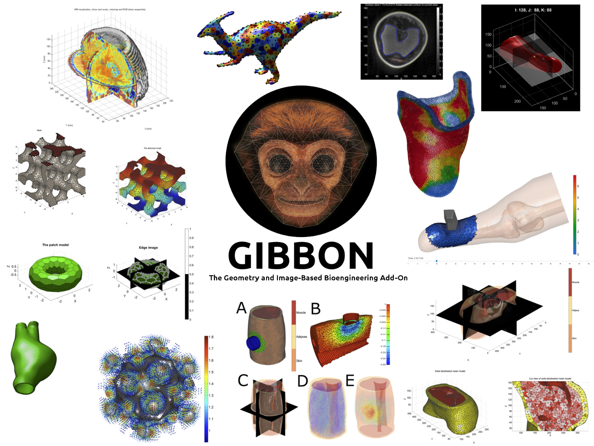
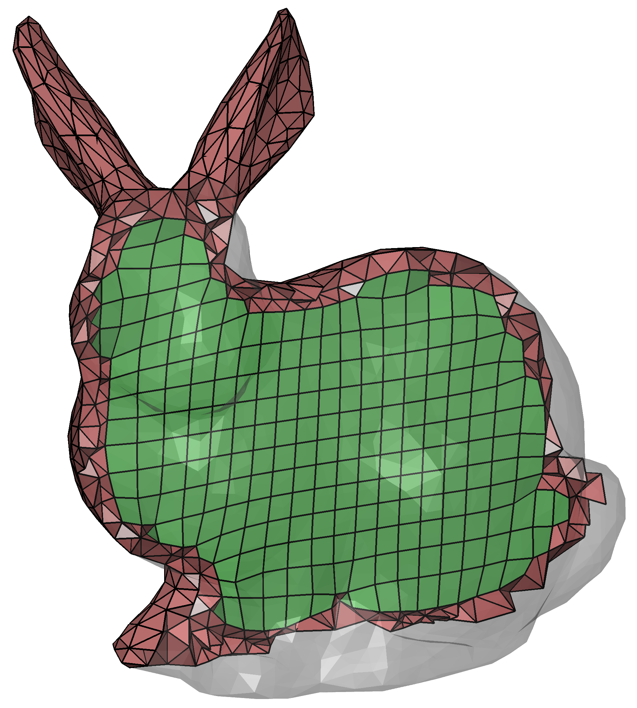
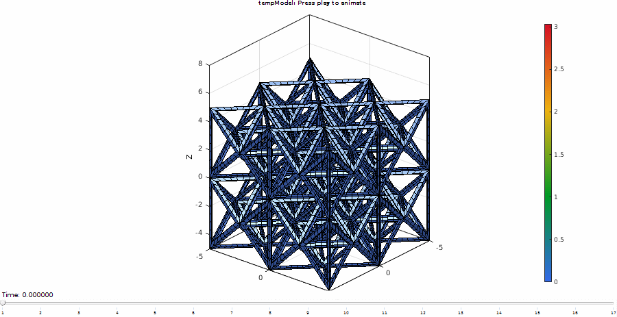
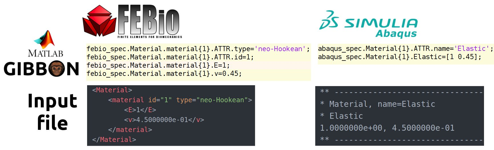
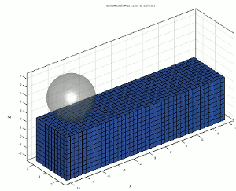
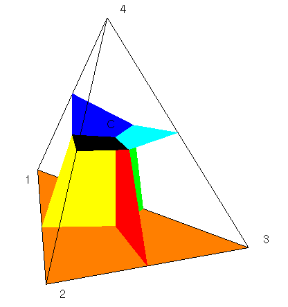

   

**Cite GIBBON:** 

**License:** 

**Join chat:** 

# Table of contents
- [Project Summary](#Summary)  
- [Application highlights](#Application)  
- [Installation](#Installation)  
- [Getting started](#Start)
- [Testing](#Test)
- [License](#License)  
- [Citing GIBBON](#Cite)
- [Contributing](#Contributing)  
- [Code of conduct](#CodeOfConduct)  
- [Road Map](#RoadMap)  

# Project summary 
GIBBON (The Geometry and Image-Based Bioengineering add-ON) is an open-source MATLAB toolbox, which includes an array of image and geometry visualization and processing tools and is interfaced with free open source software such as [TetGen](http://wias-berlin.de/software/tetgen/), for robust tetrahedral meshing, and [FEBio](http://febio.org/) for finite element analysis. The combination provides a highly flexible image-based modelling environment and enables advanced inverse finite element analysis.

## Application highlights   
- [Segmentation](#Segmentation)  
- [Computer Aided Design (CAD) tools](#CAD)  
- [Surface meshing tools](#SurfaceMeshing)  
- [Volumetric meshing](#Meshing)  
- [Lattice structures](#Lattice)
- [Finite element analysis](#FEA)
- [Visualization](#Visualization)    

### Segmentation      
GIBBON offers image filtering and smoothing methods, and has a graphical user interface for 3D image segmentation (`HELP_imx.m`). The segmented image data can be converted to 3D surface models (`DEMO_imx_levelset_surface_compare`) which can be meshed for FEA (`HELP_runTetGen`).   

   
   
   

### Computer Aided Design (CAD) tools   
Using GIBBON, geometry can be imported from common mesh based CAD files (such as STL, `HELP_import_STL`). For generating geometries within MATLAB®, GIBBON also provides several CAD-style commands such as polygon rounding (`HELP_filletCurve`), revolution (`HELP_polyRevolve`), extrusion (`HELP_polyExtrude`), and sweeping and lofting (`HELP_polyLoftLinear` and `HELP_sweepLoft`). Simple geometries such as spheres (`HELP_geoSphere`), boxes (`HELP_quadBox`), platonic solids (`HELP_platonic_solid`), and rhombic dodecahedra (`HELP_rhombicDodecahedron`) can also be directly created using GIBBON.  

### Surface meshing tools   
2D multi-region triangular meshing (e.g. `HELP_regionTriMesh2D` and `HELP_multiRegionTriMeshUneven2D`), resampling meshes geodesically (`DEMO_geodesic_remeshing`), smoothing (`DEMO_surface_smooth_methods`), and surface mesh refinement (e.g. `HELP_subtri`, `HELP_subTriDual` and `HELP_subQuad`), mesh type conversions (e.g. `HELP_tri2quad`, `HELP_quad2tri`), and mesh dual computation (`HELP_patch_dual`). Geometries can also be exported to the STL format e.g. for computer aided manufacture and 3D printing.

### Volumetric meshing    
Tetrahedral meshing (and constrained Delaunay tessellation) of multi-region domains is enabled through an interface with the [TetGen](http://wias-berlin.de/software/tetgen/) package (`HELP_runTetGen` and `HELP_constrainedDelaunayTetGen`). Hexahedral meshes for some geometry types can be directly coded (e.g. spheres `HELP_hexMeshSphere`, boxes `HELP_hexMeshBox` and lattices `HELP_element2HexLattice`). For general input surfaces multi-region mixed tetrahedral-hexahedral meshing is also available (e.g. `DEMO_MixedTetHexMeshing`).

### Lattice structures 
One method to generate surface geometry for lattices is the use of triply-periodic functions (`HELP_triplyPeriodicMinimal`). Functions to convert element descriptions, such as tetrahedral and hexahedral elements, to lattice structures have also been implemented (`HELP_element2lattice` and `HELP_element2HexLattice`). These allow for the creation of 3D boundary conforming lattice structures on arbitrary input geometry. Exporting of hexahedral elements is also supported allowing for FEA on the created lattice structures (`DEMO_febio_0026_hexlattice_compression`).

   
   
   

### Finite Element Analysis 
For finite element analysis GIBBON currently links with either the free and open source software [FEBio](http://febio.org/) or with Simulia ABAQUS. Both the FEBio and ABAQUS interface is based on MATLAB® structures. The image below shows the coding of a material section in a MATLAB® structure (top row) and how these components are represented in the input files for FEBio or ABAQUS (bottom row). Through this structure to input file conversion process **any FEBio or ABAQUS functionality can be directly coded in MATLAB®**.

   

##### FEBio
GIBBON can be used as a pre- and post- processor for FEBio as it enables code-based development of meshes, boundary conditions, and input files. FEBio files can be directly exported based on dedicated MATLAB® structures (`HELP_febioStruct2xml`). Furthermore, GIBBON can be used to start and control FEBio simulations. As such, iterative and inverse FEA (e.g. based on MATLAB® optimization routines) is also enabled. All `DEMO_febio_...` files are FEBio demos, e.g. `DEMO_febio_0001_cube_uniaxial` is a simple uniaxial loading example, and `DEMO_febio_0042_inverse_FEA_cube_uniaxial` is an example of inverse FEA.    
The image below is for large strain analysis of a twisting bar and stems from the demo `DEMO_febio_0004_beam_twist`. Other demos cover tension, compression, shear, applied forces, applied pressures, applied displacements, bending, poroelasticity, dynamic and viscoelastic analysis, contact and indentation problems, multi-generational materials for pre-load analysis.     

  
     
     

#### Abaqus
The interface for ABAQUS is a recent development. Users can look at `HELP_abaqusStruct2inp` to study how input files are coded. The demo `DEMO_abaqus_0001_cube_uniaxial` is for uniaxial loading of a cube and steps through geometry creation, setting up the ABAQUS structure, saving the .inp file, running the job, and importing the results for visualization. Data is imported into MATLAB® using `importAbaqusDat` which parses ABAQUS `.DAT` files.

### Visualization     
GIBBON expands the standard MATLAB® visualization capabilities by adding 3D image and voxel visualization (`HELP_im2patch` and `HELP_sliceViewer`), meshed geometries (`HELP_gpatch` and `HELP_meshView`), finite element models (`HELP_element2patch`), and colormapped vector data (`HELP_quiverVec`), and all visualization methods enable multiple colormaps to be used in each figure or axis window. Furthermore GIBBON offers a custom figure window `cFigure` containing 3D rotation options (`HELP_vcw`) that mimic CAD behavior of 3D scene rendering, and high quality figure exporting options (`HELP_efw`). Advanced graphics animation creation and exporting capabilities through a figure window based GUI are also enabled (`HELP_anim8`).

# Installation   

## Summary
1. Download GIBBON
2. Just run: `installGibbon.m` (found in GIBBON's main folder) and provide a link to where FEBio is installed during installation

## More detailed installation instructions
The steps below guide you through a streamlined installation procedure using the `installGibbon.m` function\*.   

\*If you prefer manual installation do the following: 1) Add the GIBBON folder (with subfolders) to the path and save the path definitions, 2) Run `createHelpDemoDocumentation.m` to integrate the help and documentation, 3) For the 3rd party packages: Go to the config folder in _../GIBBON/config_ and edit the _FEBioPath.txt_ file to contain the full path to the FEBio executable 

### 1. Get a copy of GIBBON
To use GIBBON you need to create a copy on a local directory on your machine. Obtain a copy by downloading and unzipping the latest [zip file](https://github.com/gibbonCode/GIBBON/archive/master.zip) or clone GIBBON instead e.g. using: `git clone https://github.com/gibbonCode/GIBBON.git`. You can place the GIBBON folder anywhere on your machine, however, MATLAB (and the 3rd party packages listed below) may have file permission limitations for some locations which you may need to address\*.   

\* For instance, some of GIBBON's features, such as those associated with TetGen and FEBio, regularly create and delete temporary files. As such MATLAB (and the 3rd party packes) should have full permissions for these folders. First of all users should make sure MATLAB has full (e.g. read/write/delete) permissions for the entire GIBBON folder (and its sub-folders). On some platforms the 3rd party packages require special treatment. For instance some OSX users have found it necessary to give tetGen or FEBio particular file permissions. For instance in the case of TetGen related features using `git update-index --chmod=+x path/to/tetgen`. 

### 2. Setting up 3rd party packages
Below is a list of 3rd party packages that are required for full functionality. All all included with GIBBON **except for FEBio** which users need to download and install. You may skip FEBio installation if finite element analysis (with FEBio) is not desired.

| Package | Description | Included? | Download |
|:--|:--|:--:|--:|
|[__FEBio__](https://febio.org)   |FEBio is a finite element solver and is used in GIBBON for all finite element analysis. Use of FEBio is featured in the many `DEMO_FEBio...` files. FEBio version 2.5.0 or newer is recommended. |__No__|[__FEBio website__](https://febio.org) |
|[__export_fig__](https://github.com/altmany/export_fig)   | `export_fig` helps to export publication quality images (e.g. .png, .jpg, .pdf, .eps), in GIBBON it is integrated in the export figure widget `efw` to export such images from the `cFigure` window directly. `export_fig` is also used for exporting images for creation of .gif animations with the GIBBON `anim8` function. |__Yes__|[__export_fig page on GitHub__](https://github.com/altmany/export_fig) |
|[__TetGen__](http://wias-berlin.de/software/tetgen/)   | Is used for tetrahedral meshing (and possibly constrained 3D Delaunay tessellation). See for instance `HELP_runTetGen.m`. |__Yes__| For other versions: [__TetGen website__](http://wias-berlin.de/software/tetgen/)|

### 2. Install GIBBON
By running `installGibbon.m` the GIBBON, FEBio, and export_fig path definitions will be added and saved to MATLAB. The help and documentation will also be integrated. Once finished you will be asked to restart MATLAB. `installGibbon.m` can be found in the main GIBBON folder.  

# Getting started 

### Access the integrated help
* To access the help documentation from MATLAB simply type: `gdoc` which will open the GIBBON documentation page in MATLAB's help brower. The documentation which is searchable and integrated just like the rest of MATLAB's help and documentation. You can also find this page manually under `Supplemental Software` as shown below.
* To open GIBBON documentation for a particular function can use `gdoc <functionName>` (similar to MATLAB's `doc` function). For instance for help on `im2patch` use `gdoc im2patch`. This will search the integrated help for im2patch and display the results.

### Where to find functions and the executable help and demo files
* The `lib` folder contains all GIBBON's functions.
* The `lib_ext` folder contains external functions and libraries developed by others.
* The `docs` folder contains the help & documentation files, and demo files which when "published" (using MATLAB's publish functionality) create the .html documentation files (found in `docs/html`) which are integrated in MATLAB.  

* The source for the help information for any function `functionName` is named `HELP_functionName`, and  the source for demos have `DEMO_` as part of the name. Therefore if one is interested in reproducing or starting off from codes in the help and documentation simply start typing code names starting in `HELP_` or `DEMO_` in the MATLAB command window, e.g. `HELP_ind2patch` can be used to generate the help information for the `ind2patch` function. Users can start editing the file by typing `open HELP_ind2patch` in the command window. By publishing (use `gpublish <HELP_functionName>`) the HELP_ or DEMO_ files .html files are created in the `docs\html` folder. As such if users alter or contribute code in the `lib` folder and generate associated `HELP_` or `DEMO_` files, new help and documentation is then added and rendered on the website. For new help and documentation to become integrated in MATLAB run the `createHelpDemoDocumentation` function and restart MATLAB.  

* Many of the `DEMO_` files focus on the use of FEBio. The demo `DEMO_febio_0001_cube_uniaxial` for instance features a simple cube subjected to a uniaxial load. Other demos focus on different load types, single versus multi-step analysis, different materials and inverse analysis (e.g. `DEMO_febio_0042_inverse_FEA_cube_uniaxial`).

# Testing 
GIBBON's core functionality can be tested by running `testGibbon('all','test');`. Use `testGibbon('demo','test');` or `testGibbon('help','test');` for running the demo or help files only.     
GIBBON is currently developed and tested using the most recent version of MATLAB (or the latest pre-release) and has been tested on Windows 10, Ubuntu 20.04, and Mac OS. Most of GIBBON's functionality is compatible with older MATLAB versions, especially MATLAB R2014a and newer (Delaunay tessellation and toolbox help integration are among things that have undergone large changes). Please inform the developers (or open an issue) if a particular function does not work for your MATLAB environment. It is likely that codes can be easily altered to work for your version.    
A large portion of GIBBON's functionality does not rely on special MATLAB toolboxes. However some functions do. Here is a list of toolboxes which appear to be used in GIBBON:
* Image Processing Toolbox
* Statistics and Machine Learning Toolbox
* Symbolic Math Toolbox
* Curve Fitting Toolbox
* Parallel Computing Toolbox

# License 
GIBBON is provided under:
. The [license file](https://github.com/gibbonCode/GIBBON/blob/master/LICENSE) is found on the GitHub repository.

# Citing GIBBON 
If you use GIBBON in your work you should cite the following paper:  
    

> Moerman, (2018). GIBBON: _The Geometry and Image-Based Bioengineering add-On_. Journal of Open Source Software, 3(22), 506, [https://doi.org/10.21105/joss.00506](https://doi.org/10.21105/joss.00506)

# Contributing 
We'd love for you to contribute to GIBBON or even to join the development team! We welcome all sorts of contributions including technical content, documentation developments, or website improvements. Please read our [contributing guidelines](CONTRIBUTING.md).

You can also ask questions and learn more about contributing via Gitter chat: 

# Code of conduct 
See [CODE_OF_CONDUCT](CODE_OF_CONDUCT.md)

# Roadmap 
See [ROADMAP](ROADMAP.md)
