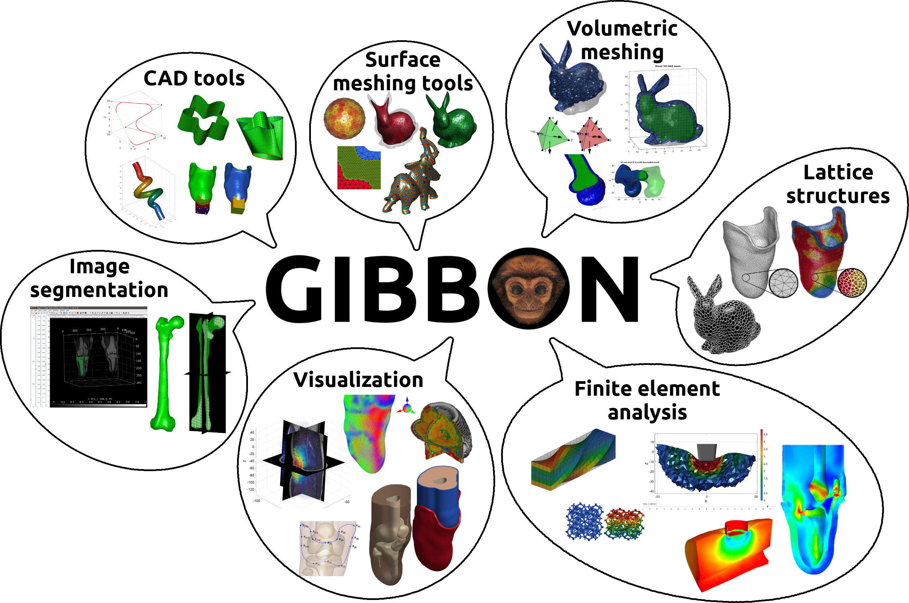

## About GIBBON
GIBBON (The Geometry and Image-Based Bioengineering add-On) is an open-source MATLAB toolbox by [Kevin M. Moerman](https://kevinmoerman.org) and includes an array of image and geometry visualization and processing tools and is interfaced with free open source software such as [TetGen](https://wias-berlin.de/software/tetgen/), for robust tetrahedral meshing, and [FEBio](https://febio.org/) for finite element analysis. The combination provides a highly flexible image-based modelling environment and enables advanced inverse finite element analysis.

{:width="100%"}
