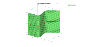
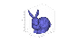
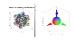
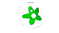
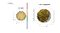
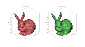
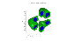
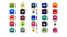

 
__The documentation is a work in progress__. Not all functions have associated help files and not all functionality is covered by the demos. The help files currently cover about 50% of the functions and the demos mainly cover the use of FEBio.  
 
#### Table of content
* [The MATLAB integrated help](#helpMatlab)
* [Function help files](#help)
* [Demo files](#demo)
 
## The MATLAB integrated help   
Follow the installation instructions to integrate and access GIBBON documentation from within MATLAB. The name for all function help files (the files that generate the help/documentation when published with MATLAB) starts with `HELP_`, all demo files start with `DEMO_`. This way users may explore/open/edit these files by typing `open HELP_functionName` or `open DEMO_functionName` in the MATLAB command window
 
## Function help files    

[HELP_addBoundaryLevel_FEB](html/HELP_addBoundaryLevel_FEB.html)  
[HELP_addConstraintsLevel_FEB](html/HELP_addConstraintsLevel_FEB.html)  
[HELP_addContactLevel_FEB](html/HELP_addContactLevel_FEB.html)  
[HELP_addControlLevel_FEB](html/HELP_addControlLevel_FEB.html)  
[HELP_addGLobalsLevel_FEB](html/HELP_addGLobalsLevel_FEB.html)  
[HELP_addGeometryLevel_FEB](html/HELP_addGeometryLevel_FEB.html)  
[HELP_addMatAxisFibreElementData_FEB](html/HELP_addMatAxisFibreElementData_FEB.html)  
[HELP_adjacentdircount](html/HELP_adjacentdircount.html) {:height="40px"}  
[HELP_affineTransformationMatrixDirect](html/HELP_affineTransformationMatrixDirect.html) {:height="40px"}  
[HELP_anim8](html/HELP_anim8.html) {:height="40px"}  
[HELP_bias_nodes1d](html/HELP_bias_nodes1d.html) {:height="40px"}  
[HELP_biharmonicSplineInterpolation](html/HELP_biharmonicSplineInterpolation.html) {:height="40px"}  
[HELP_box_indices](html/HELP_box_indices.html) {:height="40px"}  
[HELP_cFigure](html/HELP_cFigure.html) {:height="40px"}  
[HELP_cap_patchcylinder](html/HELP_cap_patchcylinder.html) {:height="40px"}  
[HELP_cart2im](html/HELP_cart2im.html) {:height="40px"}  
[HELP_cell2txtfile](html/HELP_cell2txtfile.html)  
[HELP_cellEig](html/HELP_cellEig.html)  
[HELP_checkerBoard3D](html/HELP_checkerBoard3D.html) {:height="40px"}  
[HELP_constrainedDelaunayTetGen](html/HELP_constrainedDelaunayTetGen.html) {:height="40px"}  
[HELP_dcmFolder2MATobject](html/HELP_dcmFolder2MATobject.html) {:height="40px"}  
[HELP_discQuadMesh](html/HELP_discQuadMesh.html) {:height="40px"}  
[HELP_edgeListToCurve](html/HELP_edgeListToCurve.html) {:height="40px"}  
[HELP_efw](html/HELP_efw.html)  
[HELP_element2HexLattice](html/HELP_element2HexLattice.html) {:height="40px"}  
[HELP_ellipsoidFit_centered](html/HELP_ellipsoidFit_centered.html) {:height="40px"}  
[HELP_euler2DCM](html/HELP_euler2DCM.html) {:height="40px"}  
[HELP_evenlySampleCurve](html/HELP_evenlySampleCurve.html) {:height="40px"}  
[HELP_export_INP](html/HELP_export_INP.html) {:height="40px"}  
[HELP_export_STL_txt](html/HELP_export_STL_txt.html) {:height="40px"}  
[HELP_filletCurve](html/HELP_filletCurve.html) {:height="40px"}  
[HELP_foamWrap](html/HELP_foamWrap.html) {:height="40px"}  
[HELP_geoSphere](html/HELP_geoSphere.html) {:height="40px"}  
[HELP_graphicsModels](html/HELP_graphicsModels.html) {:height="40px"}  
[HELP_hemiSphereCylMesh](html/HELP_hemiSphereCylMesh.html) {:height="40px"}  
[HELP_hemiSphereRegionMesh](html/HELP_hemiSphereRegionMesh.html) {:height="40px"}  
[HELP_hessianScalar](html/HELP_hessianScalar.html) {:height="40px"}  
[HELP_hex2tet](html/HELP_hex2tet.html) {:height="40px"}  
[HELP_hexMeshBox](html/HELP_hexMeshBox.html) {:height="40px"}  
[HELP_hexMeshSphere](html/HELP_hexMeshSphere.html) {:height="40px"}  
[HELP_honeyCombMesh](html/HELP_honeyCombMesh.html) {:height="40px"}  
[HELP_im2cart](html/HELP_im2cart.html) {:height="40px"}  
[HELP_im2patch](html/HELP_im2patch.html) {:height="40px"}  
[HELP_importAnyBodyOutput](html/HELP_importAnyBodyOutput.html) {:height="40px"}  
[HELP_importFEBio_logfile](html/HELP_importFEBio_logfile.html) {:height="40px"}  
[HELP_import_FEB](html/HELP_import_FEB.html) {:height="40px"}  
[HELP_import_INP](html/HELP_import_INP.html) {:height="40px"}  
[HELP_import_STL](html/HELP_import_STL.html) {:height="40px"}  
[HELP_import_STL_bin](html/HELP_import_STL_bin.html) {:height="40px"}  
[HELP_import_STL_txt](html/HELP_import_STL_txt.html) {:height="40px"}  
[HELP_import_off](html/HELP_import_off.html) {:height="40px"}  
[HELP_imx](html/HELP_imx.html) {:height="40px"}  
[HELP_ind2patch](html/HELP_ind2patch.html) {:height="40px"}  
[HELP_interp1_ND](html/HELP_interp1_ND.html) {:height="40px"}  
[HELP_interp_spherical](html/HELP_interp_spherical.html) {:height="40px"}  
[HELP_joinElementSets](html/HELP_joinElementSets.html) {:height="40px"}  
[HELP_linspacen](html/HELP_linspacen.html) {:height="40px"}  
[HELP_minDist](html/HELP_minDist.html) {:height="40px"}  
[HELP_minPolyTwist](html/HELP_minPolyTwist.html) {:height="40px"}  
[HELP_multiRegionTriMesh2D](html/HELP_multiRegionTriMesh2D.html) {:height="40px"}  
[HELP_multiRegionTriMeshUneven2D](html/HELP_multiRegionTriMeshUneven2D.html) {:height="40px"}  
[HELP_numReplace](html/HELP_numReplace.html)  
[HELP_parLimNat](html/HELP_parLimNat.html) {:height="40px"}  
[HELP_patch2Im](html/HELP_patch2Im.html) {:height="40px"}  
[HELP_patch2STL](html/HELP_patch2STL.html) {:height="40px"}  
[HELP_patchDual](html/HELP_patchDual.html) {:height="40px"}  
[HELP_patchEdge2Im](html/HELP_patchEdge2Im.html) {:height="40px"}  
[HELP_patchTorus](html/HELP_patchTorus.html) {:height="40px"}  
[HELP_patchcylinder](html/HELP_patchcylinder.html) {:height="40px"}  
[HELP_platonic_solid](html/HELP_platonic_solid.html) {:height="40px"}  
[HELP_pointLocationTR](html/HELP_pointLocationTR.html) {:height="40px"}  
[HELP_pointSetDistMap](html/HELP_pointSetDistMap.html) {:height="40px"}  
[HELP_pointSetPrincipalDir](html/HELP_pointSetPrincipalDir.html) {:height="40px"}  
[HELP_polyExtrude](html/HELP_polyExtrude.html) {:height="40px"}  
[HELP_polyLoftLinear](html/HELP_polyLoftLinear.html) {:height="40px"}  
[HELP_polySet2Im](html/HELP_polySet2Im.html) {:height="40px"}  
[HELP_polyTube](html/HELP_polyTube.html) {:height="40px"}  
[HELP_quad2tri](html/HELP_quad2tri.html) {:height="40px"}  
[HELP_quadBox](html/HELP_quadBox.html) {:height="40px"}  
[HELP_quadSphere](html/HELP_quadSphere.html) {:height="40px"}  
[HELP_quiver3Dpatch](html/HELP_quiver3Dpatch.html) {:height="40px"}  
[HELP_regionTriMesh2D](html/HELP_regionTriMesh2D.html) {:height="40px"}  
[HELP_regionTriMesh3D](html/HELP_regionTriMesh3D.html) {:height="40px"}  
[HELP_regionTriMeshRand2D](html/HELP_regionTriMeshRand2D.html) {:height="40px"}  
[HELP_resampleColormap](html/HELP_resampleColormap.html) {:height="40px"}  
[HELP_rgbImage2ColorMap](html/HELP_rgbImage2ColorMap.html) {:height="40px"}  
[HELP_rhombicDodecahedron](html/HELP_rhombicDodecahedron.html) {:height="40px"}  
[HELP_rhombicDodecahedronMesh](html/HELP_rhombicDodecahedronMesh.html) {:height="40px"}  
[HELP_rigidTransformationMatrixDirect](html/HELP_rigidTransformationMatrixDirect.html) {:height="40px"}  
[HELP_runTetGen](html/HELP_runTetGen.html) {:height="40px"}  
[HELP_sampleCurveEvenly](html/HELP_sampleCurveEvenly.html) {:height="40px"}  
[HELP_set_mat_par_FEBIO](html/HELP_set_mat_par_FEBIO.html) {:height="40px"}  
[HELP_splitCurveSetMesh](html/HELP_splitCurveSetMesh.html) {:height="40px"}  
[HELP_stanford_bunny](html/HELP_stanford_bunny.html) {:height="40px"}  
[HELP_subCurve](html/HELP_subCurve.html) {:height="40px"}  
[HELP_subEdge](html/HELP_subEdge.html) {:height="40px"}  
[HELP_subHex](html/HELP_subHex.html) {:height="40px"}  
[HELP_subTet](html/HELP_subTet.html) {:height="40px"}  
[HELP_subTriCentre](html/HELP_subTriCentre.html) {:height="40px"}  
[HELP_subTriDual](html/HELP_subTriDual.html) {:height="40px"}  
[HELP_subTriLocal](html/HELP_subTriLocal.html) {:height="40px"}  
[HELP_subtri](html/HELP_subtri.html) {:height="40px"}  
[HELP_sweepLoft](html/HELP_sweepLoft.html) {:height="40px"}  
[HELP_tesIND](html/HELP_tesIND.html) {:height="40px"}  
[HELP_testGibbon](html/HELP_testGibbon.html)  
[HELP_tet2hex](html/HELP_tet2hex.html) {:height="40px"}  
[HELP_tet4_tet10](html/HELP_tet4_tet10.html) {:height="40px"}  
[HELP_tetVolMeanEst](html/HELP_tetVolMeanEst.html) {:height="40px"}  
[HELP_tri2quad](html/HELP_tri2quad.html) {:height="40px"}  
[HELP_triMeshEquilateral](html/HELP_triMeshEquilateral.html) {:height="40px"}  
[HELP_triPolyDualRefine](html/HELP_triPolyDualRefine.html) {:height="40px"}  
[HELP_triSurf2Im](html/HELP_triSurf2Im.html) {:height="40px"}  
[HELP_triSurfRemoveThreeConnect](html/HELP_triSurfRemoveThreeConnect.html) {:height="40px"}  
[HELP_triSurfSetDist](html/HELP_triSurfSetDist.html) {:height="40px"}  
[HELP_triplyPeriodicMinimal](html/HELP_triplyPeriodicMinimal.html) {:height="40px"}  
[HELP_uiContourSegment](html/HELP_uiContourSegment.html)  
[HELP_uiThreshErode](html/HELP_uiThreshErode.html)  
[HELP_vcw](html/HELP_vcw.html)  
[HELP_vectorOrthogonalPair](html/HELP_vectorOrthogonalPair.html) {:height="40px"}  
[HELP_viewFourthOrderTensor](html/HELP_viewFourthOrderTensor.html) {:height="40px"}  
[HELP_voronoiDiagramEven2D](html/HELP_voronoiDiagramEven2D.html) {:height="40px"}  
## Demo files   

[DEMO_AnyBody_force_analysys](html/DEMO_AnyBody_force_analysys.html) {:height="40px"}  
[DEMO_FEBio_active_contraction_01](html/DEMO_FEBio_active_contraction_01.html) {:height="40px"}  
[DEMO_FEBio_bar_force](html/DEMO_FEBio_bar_force.html) {:height="40px"}  
[DEMO_FEBio_bar_soft_sphere_indentation](html/DEMO_FEBio_bar_soft_sphere_indentation.html) {:height="40px"}  
[DEMO_FEBio_bar_sphere_indentation](html/DEMO_FEBio_bar_sphere_indentation.html) {:height="40px"}  
[DEMO_FEBio_bar_sphere_indentation_multi_generation](html/DEMO_FEBio_bar_sphere_indentation_multi_generation.html) {:height="40px"}  
[DEMO_FEBio_bar_sphere_indentation_multi_step](html/DEMO_FEBio_bar_sphere_indentation_multi_step.html) {:height="40px"}  
[DEMO_FEBio_beam_bending](html/DEMO_FEBio_beam_bending.html) {:height="40px"}  
[DEMO_FEBio_block_biaxial_loading_stiffness_analysis](html/DEMO_FEBio_block_biaxial_loading_stiffness_analysis.html) {:height="40px"}  
[DEMO_FEBio_block_uniaxial_compression](html/DEMO_FEBio_block_uniaxial_compression.html) {:height="40px"}  
[DEMO_FEBio_block_uniaxial_compression_biphasic_ramp_hold](html/DEMO_FEBio_block_uniaxial_compression_biphasic_ramp_hold.html) {:height="40px"}  
[DEMO_FEBio_block_uniaxial_compression_fibre_reinforced](html/DEMO_FEBio_block_uniaxial_compression_fibre_reinforced.html) {:height="40px"}  
[DEMO_FEBio_block_uniaxial_compression_viscoelastic_load_unload](html/DEMO_FEBio_block_uniaxial_compression_viscoelastic_load_unload.html) {:height="40px"}  
[DEMO_FEBio_block_uniaxial_compression_viscoelastic_ramp_hold](html/DEMO_FEBio_block_uniaxial_compression_viscoelastic_ramp_hold.html) {:height="40px"}  
[DEMO_FEBio_continuous_fibre_distribution](html/DEMO_FEBio_continuous_fibre_distribution.html) {:height="40px"}  
[DEMO_FEBio_cube_multi_generation](html/DEMO_FEBio_cube_multi_generation.html) {:height="40px"}  
[DEMO_FEBio_cube_multi_step](html/DEMO_FEBio_cube_multi_step.html) {:height="40px"}  
[DEMO_FEBio_cube_tension](html/DEMO_FEBio_cube_tension.html) {:height="40px"}  
[DEMO_FEBio_cube_viscoelastic_aniso](html/DEMO_FEBio_cube_viscoelastic_aniso.html) {:height="40px"}  
[DEMO_FEBio_cylinder_embedded_indentor_01](html/DEMO_FEBio_cylinder_embedded_indentor_01.html) {:height="40px"}  
[DEMO_FEBio_cylinder_spherical_head_indentor](html/DEMO_FEBio_cylinder_spherical_head_indentor.html) {:height="40px"}  
[DEMO_FEBio_disc_probe_indentation](html/DEMO_FEBio_disc_probe_indentation.html) {:height="40px"}  
[DEMO_FEBio_iFEA_uniaxial_01](html/DEMO_FEBio_iFEA_uniaxial_01.html) {:height="40px"}  
[DEMO_FEBio_iFEA_uniaxial_transiso_01](html/DEMO_FEBio_iFEA_uniaxial_transiso_01.html) {:height="40px"}  
[DEMO_FEBio_iFEA_uniaxial_transiso_02](html/DEMO_FEBio_iFEA_uniaxial_transiso_02.html) {:height="40px"}  
[DEMO_FEBio_iFEA_uniaxial_transiso_03](html/DEMO_FEBio_iFEA_uniaxial_transiso_03.html) {:height="40px"}  
[DEMO_FEBio_layered_spatvar](html/DEMO_FEBio_layered_spatvar.html) {:height="40px"}  
[DEMO_FEBio_skin_sphere_indentation](html/DEMO_FEBio_skin_sphere_indentation.html) {:height="40px"}  
[DEMO_FEBio_skin_sphere_indentation_tet4_vs_tet10](html/DEMO_FEBio_skin_sphere_indentation_tet4_vs_tet10.html) {:height="40px"}  
[DEMO_FEBio_slab_displacement_loading_01](html/DEMO_FEBio_slab_displacement_loading_01.html) {:height="40px"}  
[DEMO_FEBio_slab_pressure_loading_01](html/DEMO_FEBio_slab_pressure_loading_01.html) {:height="40px"}  
[DEMO_FEBio_slab_pressure_loading_02](html/DEMO_FEBio_slab_pressure_loading_02.html) {:height="40px"}  
[DEMO_FEBio_slab_pressure_loading_03](html/DEMO_FEBio_slab_pressure_loading_03.html) {:height="40px"}  
[DEMO_FEBio_spatially_varying_material_parameters](html/DEMO_FEBio_spatially_varying_material_parameters.html) {:height="40px"}  
[DEMO_FEBio_spheres_preload_multigen](html/DEMO_FEBio_spheres_preload_multigen.html) {:height="40px"}  
[DEMO_FEBio_strip_multi_step_clamp](html/DEMO_FEBio_strip_multi_step_clamp.html) {:height="40px"}  
[DEMO_FEBio_strip_multi_step_clamp_contact](html/DEMO_FEBio_strip_multi_step_clamp_contact.html) {:height="40px"}  
[DEMO_FEBio_tongue](html/DEMO_FEBio_tongue.html) {:height="40px"}  
[DEMO_FEBio_trabeculae_compression](html/DEMO_FEBio_trabeculae_compression.html) {:height="40px"}  
[DEMO_MixedTetHexMeshing_torus](html/DEMO_MixedTetHexMeshing_torus.html) {:height="40px"}  
[DEMO_additional_colormaps](html/DEMO_additional_colormaps.html) {:height="40px"}  
[DEMO_create_run_import_FEBIO_spheres](html/DEMO_create_run_import_FEBIO_spheres.html) {:height="40px"}  
[DEMO_create_run_import_FEBIO_spheres_pressure](html/DEMO_create_run_import_FEBIO_spheres_pressure.html) {:height="40px"}  
[DEMO_create_run_import_FEBIO_spheres_traction](html/DEMO_create_run_import_FEBIO_spheres_traction.html) {:height="40px"}  
[DEMO_femur_STL_surface_improvement](html/DEMO_femur_STL_surface_improvement.html) {:height="40px"}  
[DEMO_geodesic_remeshing](html/DEMO_geodesic_remeshing.html) {:height="40px"}  
[DEMO_import_FEB_export_INP](html/DEMO_import_FEB_export_INP.html) {:height="40px"}  
[DEMO_tetGen_mesh_sizing_function_1](html/DEMO_tetGen_mesh_sizing_function_1.html) {:height="40px"}  
[DEMO_vessel_FEBIO_fibre_mapping](html/DEMO_vessel_FEBIO_fibre_mapping.html) {:height="40px"}  
